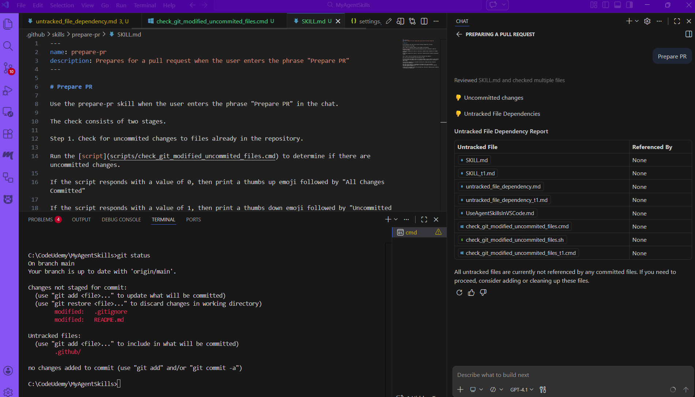
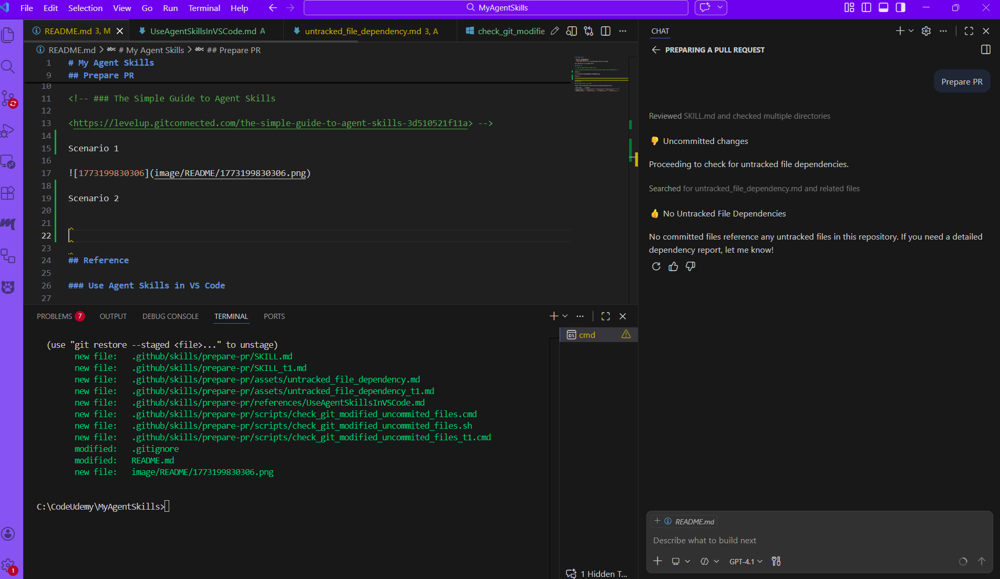
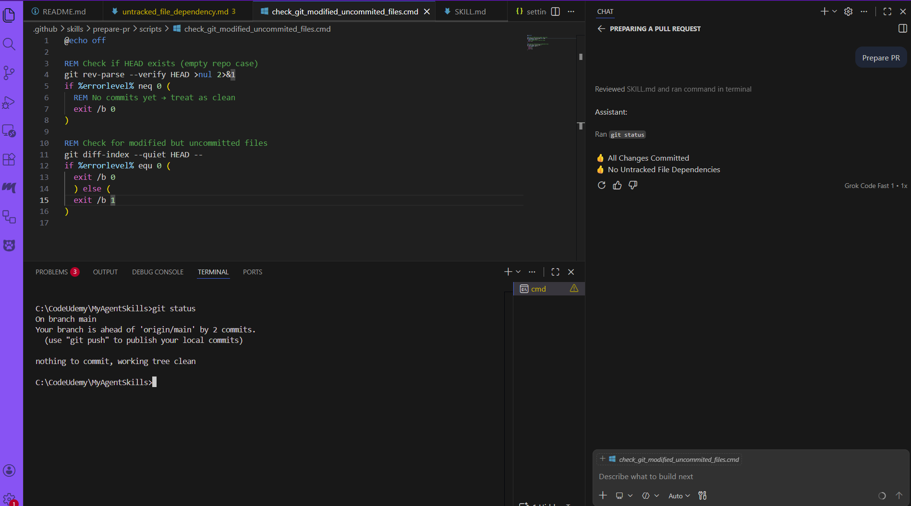

# My Agent Skills

- [Prepare PR](#prepare-pr)
- [Reference](#reference)
  - [Use Agent Skills in VS Code](#use-agent-skills-in-vs-code)

This repo has all of my agent skills.

## Prepare PR

<!-- ### The Simple Guide to Agent Skills

<https://levelup.gitconnected.com/the-simple-guide-to-agent-skills-3d510521f11a> -->

Scenario 1

Scenario 2

Scenario 3

## Reference

### Use Agent Skills in VS Code

<https://code.visualstudio.com/docs/copilot/customization/agent-skills>

| Skill type      | Location                                                       |
| --------------- | -------------------------------------------------------------- |
| Project skills  | `.github/skills/`, `.claude/skills/`, `.agents/skills/`        |
| Personal skills | `~/.copilot/skills/`, `~/.claude/skills/`, `~/.agents/skills/` |
